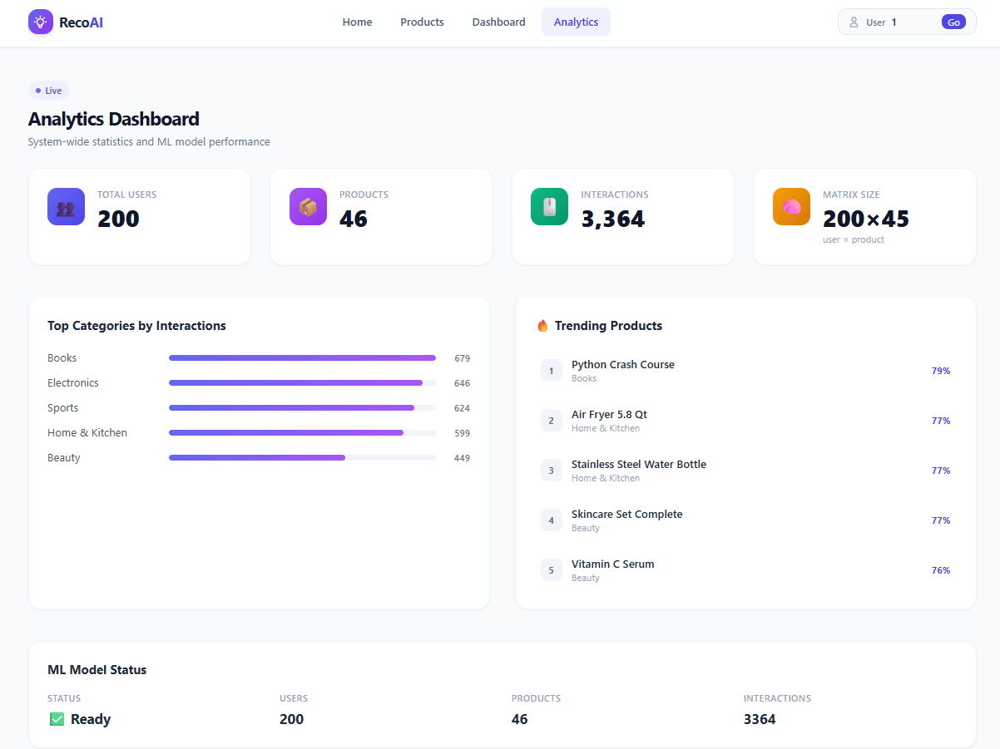
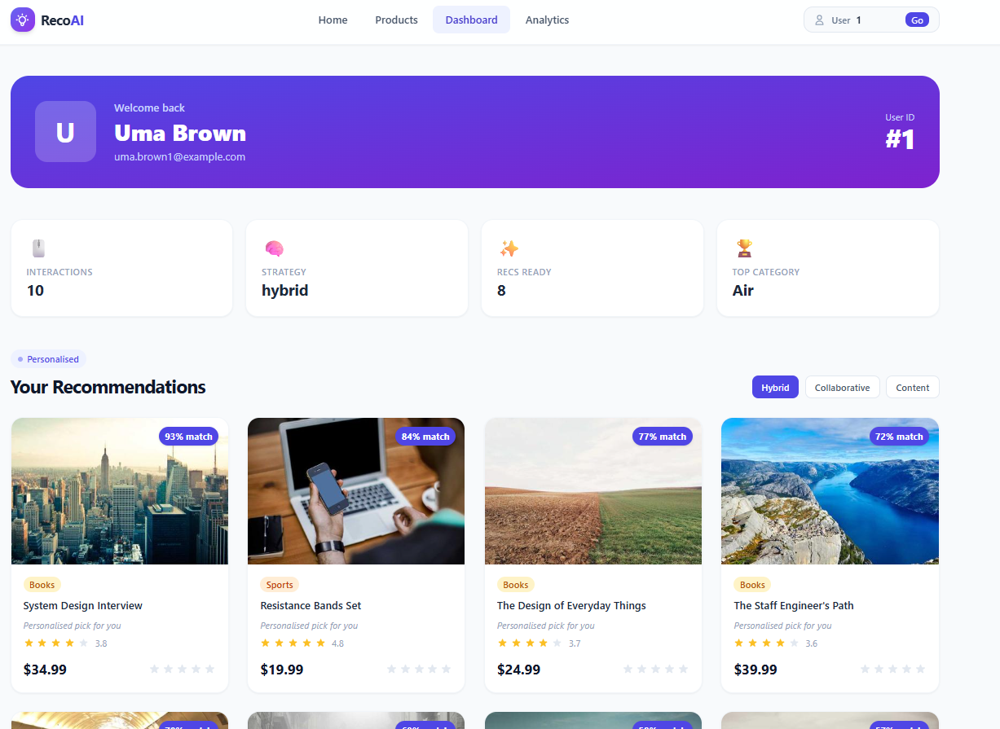

# 🧠 RecoAI — Intelligent E-commerce Recommendation System

A production-grade, full-stack recommendation engine that delivers personalised product suggestions using a **hybrid ML model** combining collaborative filtering and content-based filtering.

---

## 📸 Screenshots

```




┌─────────────────────────────────────────────────────────────┐
│  Home Page  │  Products  │  Dashboard  │  Analytics         │
├─────────────┼────────────┼─────────────┼───────────────────┤
│ Hero banner │ Category   │ User stats  │ KPI cards         │
│ Recs grid   │ filter     │ Rec grid    │ Top categories    │
│ Trending    │ Pagination │ History     │ ML model status   │
│ Strategy    │ Product    │ table       │ A/B experiments   │
│ switcher    │ cards      │             │                   │
└─────────────┴────────────┴─────────────┴───────────────────┘
```

---

## 🏗️ Architecture

```
┌─────────────────────────────────────────────────────────────┐
│                      Browser / Client                        │
│                 Next.js 14  +  Tailwind CSS                  │
└──────────────────────────┬──────────────────────────────────┘
                           │  HTTP / REST (Axios)
┌──────────────────────────▼──────────────────────────────────┐
│                   FastAPI  (Python 3.11)                     │
│  ┌──────────┐  ┌───────────┐  ┌──────────┐  ┌───────────┐  │
│  │ /products│  │/recommend │  │ /interact│  │/analytics │  │
│  └────┬─────┘  └─────┬─────┘  └────┬─────┘  └─────┬─────┘  │
│       │              │              │               │        │
│  ┌────▼──────────────▼──────────────▼───────────────▼─────┐  │
│  │              Services Layer                             │  │
│  │  DataService │ RecommendationEngine │ ABTestingService  │  │
│  └────────────────────────────┬────────────────────────────┘  │
│                               │                              │
│  ┌────────────────────────────▼────────────────────────────┐  │
│  │              ML Engine (scikit-learn)                    │  │
│  │  ┌──────────────────┐  ┌──────────────────┐             │  │
│  │  │ Collaborative    │  │ Content-Based    │             │  │
│  │  │ Filtering        │  │ Filtering        │             │  │
│  │  │ (Cosine sim on   │  │ (TF-IDF on       │             │  │
│  │  │  user-item matrix│  │  descriptions)   │             │  │
│  │  └────────┬─────────┘  └────────┬─────────┘             │  │
│  │           └──────────┬──────────┘                        │  │
│  │                ┌─────▼──────┐                            │  │
│  │                │   Hybrid   │ (60% collab + 40% content) │  │
│  │                └────────────┘                            │  │
│  └──────────────────────────────────────────────────────────┘  │
└──────────────────────────┬──────────────────────────────────┘
                           │  asyncpg
┌──────────────────────────▼──────────────────────────────────┐
│                    PostgreSQL 16                              │
│  users │ products │ interactions │ ab_experiments │ analytics│
└─────────────────────────────────────────────────────────────┘
```

---

## 📂 Project Structure

```
ecommerce-recommender/
├── backend/
│   ├── app/
│   │   └── main.py              # FastAPI app factory + lifespan
│   ├── routes/
│   │   ├── health.py            # GET /
│   │   ├── products.py          # GET /products, /products/{id}, /trending
│   │   ├── recommendations.py   # GET /recommend/{user_id}
│   │   ├── interactions.py      # POST /interact
│   │   ├── users.py             # GET /users/{id}
│   │   └── analytics.py         # GET /analytics/dashboard
│   ├── models/
│   │   └── schemas.py           # Pydantic v2 request/response schemas
│   ├── services/
│   │   ├── recommender.py       # Hybrid ML engine (collab + content)
│   │   ├── data_service.py      # CSV loader + preprocessing
│   │   └── ab_service.py        # A/B testing logic
│   ├── database/
│   │   ├── schema.sql           # PostgreSQL DDL
│   │   ├── connection.py        # SQLAlchemy async engine
│   │   └── orm_models.py        # SQLAlchemy ORM models
│   ├── data/
│   │   ├── users.csv            # 200 synthetic users
│   │   ├── products.csv         # 46 products (7 categories)
│   │   └── interactions.csv     # 3,364 rating interactions
│   ├── requirements.txt
│   └── Dockerfile
├── frontend/
│   ├── pages/
│   │   ├── _app.js              # Global layout + user state
│   │   ├── index.js             # Home: hero + recs + trending
│   │   ├── products/
│   │   │   ├── index.js         # Catalogue with filter + pagination
│   │   │   └── [id].js          # Product detail + similar items
│   │   ├── dashboard.js         # User personalisation dashboard
│   │   └── analytics.js         # Admin analytics + A/B experiments
│   ├── components/
│   │   ├── Navbar.jsx           # Sticky nav + user selector
│   │   ├── ProductCard.jsx      # Card with inline star-rating
│   │   ├── Skeleton.jsx         # Loading placeholders
│   │   ├── ErrorState.jsx       # Error UI with retry
│   │   └── SectionHeader.jsx    # Reusable section titles
│   ├── services/
│   │   └── api.js               # Axios client + all API calls
│   ├── styles/
│   │   └── globals.css
│   ├── package.json
│   ├── tailwind.config.js
│   └── Dockerfile
├── scripts/
│   ├── generate_data.py         # Synthetic dataset generator
│   └── retrain.py               # Standalone model retraining
├── nginx/
│   └── nginx.conf               # Reverse proxy (production)
├── docker-compose.yml
├── .env.example
└── README.md
```

---

## 🧠 Machine Learning Details

### 1. Collaborative Filtering
- Builds a **user × product rating matrix** (200 × 46)
- Computes **cosine similarity** between all user pairs
- For each target user, finds the **K=20 nearest neighbours**
- Predicts ratings as a **weighted average** of neighbours' ratings
- Falls back to popularity-based scores for cold-start users

### 2. Content-Based Filtering
- Vectorises `category + name + description` using **TF-IDF** (bigrams, 5000 features)
- Builds a **user preference profile** by averaging TF-IDF vectors of liked products (rating ≥ 3.5), weighted by rating
- Scores candidates by **cosine similarity** to the user profile

### 3. Hybrid Recommendation
```
hybrid_score = 0.6 × collaborative_score + 0.4 × content_score
```
Both scores are independently **min-max normalised** before blending.

### 4. Trending Products
- Counts interactions within a rolling **30-day window**
- Composite score: `0.6 × normalised_count + 0.4 × normalised_avg_rating`

### 5. Similar Products
- Pure content-based cosine similarity between product TF-IDF vectors

---

## 🌐 API Reference

| Method | Endpoint | Description |
|--------|----------|-------------|
| `GET`  | `/` | Health check + model status |
| `GET`  | `/products` | Paginated product list (filter by `category`) |
| `GET`  | `/products/{id}` | Single product detail |
| `GET`  | `/products/{id}/similar` | Content-based similar products |
| `GET`  | `/products/trending` | Trending by recent interactions |
| `GET`  | `/products/categories` | List all categories |
| `GET`  | `/recommend/{user_id}` | Personalised recommendations (`strategy`, `n`, `ab_test`) |
| `GET`  | `/recommend/{user_id}/ab-variant` | A/B experiment assignment |
| `POST` | `/interact` | Record interaction (view/click/purchase/wishlist) |
| `GET`  | `/interact/user/{user_id}` | User interaction history |
| `GET`  | `/users/{user_id}` | User profile |
| `GET`  | `/users` | Paginated user list |
| `GET`  | `/analytics/dashboard` | Aggregate stats + trending + A/B info |

**Recommendation strategies:** `hybrid` (default) · `collaborative` · `content`

---

## 🗄️ Database Schema

```sql
users        (id, name, email, password_hash, avatar_url, created_at)
products     (id, name, category, description, price, image_url, stock, rating_avg)
interactions (id, user_id, product_id, rating, interaction_type, timestamp)
             -- interaction_type: view | click | purchase | wishlist
ab_experiments  (id, name, variant_a, variant_b, is_active)
ab_assignments  (id, experiment_id, user_id, variant)
analytics_events (id, user_id, event_type, properties JSONB)
```

---

## 🚀 Setup & Running

### Option A — Docker Compose (recommended)

```bash
# 1. Clone / download the project
cd ecommerce-recommender

# 2. Copy environment file
cp .env.example .env

# 3. Generate synthetic data (only needed once)
python scripts/generate_data.py

# 4. Start all services
docker compose up --build

# Access:
#   Frontend  → http://localhost:3000
#   Backend   → http://localhost:8000
#   API docs  → http://localhost:8000/docs
```

### Option B — Local development

**Backend**
```bash
cd backend
python -m venv .venv && source .venv/bin/activate   # Windows: .venv\Scripts\activate
pip install -r requirements.txt

# Generate data
cd .. && python scripts/generate_data.py

# Start API server
cd backend
PYTHONPATH=. uvicorn app.main:app --reload --port 8000
```

**Frontend**
```bash
cd frontend
npm install
NEXT_PUBLIC_API_URL=http://localhost:8000 npm run dev
# → http://localhost:3000
```

### Retrain the model
```bash
python scripts/retrain.py
# or with custom output:
python scripts/retrain.py --output-dir backend/model_cache
```

---

## 🧪 Feature Checklist

| Feature | Status |
|---------|--------|
| Collaborative Filtering (cosine sim) | ✅ |
| Content-Based Filtering (TF-IDF) | ✅ |
| Hybrid Recommendation (weighted blend) | ✅ |
| Trending Products section | ✅ |
| Similar Products (content-based) | ✅ |
| User interaction tracking | ✅ |
| Real-time recommendation updates | ✅ (background retrain on each interaction) |
| Loading states + error handling | ✅ |
| A/B Testing (deterministic, hash-based) | ✅ |
| Analytics Dashboard | ✅ |
| Model retraining script | ✅ |
| PostgreSQL schema | ✅ |
| Docker + Docker Compose | ✅ |
| Nginx reverse proxy | ✅ |
| Paginated product catalogue | ✅ |
| Category filtering | ✅ |
| Star rating input | ✅ |
| Responsive Tailwind UI | ✅ |
| FastAPI auto-generated docs | ✅ → /docs |

---

## 🔐 Auth Notes

JWT authentication scaffolding is prepared (`SECRET_KEY` in `.env`).  
To activate it, add `python-jose[cryptography]` and `passlib` to `requirements.txt`  
and wire up the `/auth/login` and `/auth/register` routes.

---

## 📈 Scaling Considerations

- **Model retraining:** Run `scripts/retrain.py` on a schedule (cron / Celery Beat) and hot-swap the pickle
- **Database:** Add read replicas + connection pooling (PgBouncer) for high traffic
- **Caching:** Add Redis in front of `/recommend` endpoints (TTL ~5 min)
- **More data:** Swap CSV layer for direct PostgreSQL reads in `DataService`
- **Model upgrade:** Drop in `surprise`, `implicit`, or a neural CF model with the same interface
